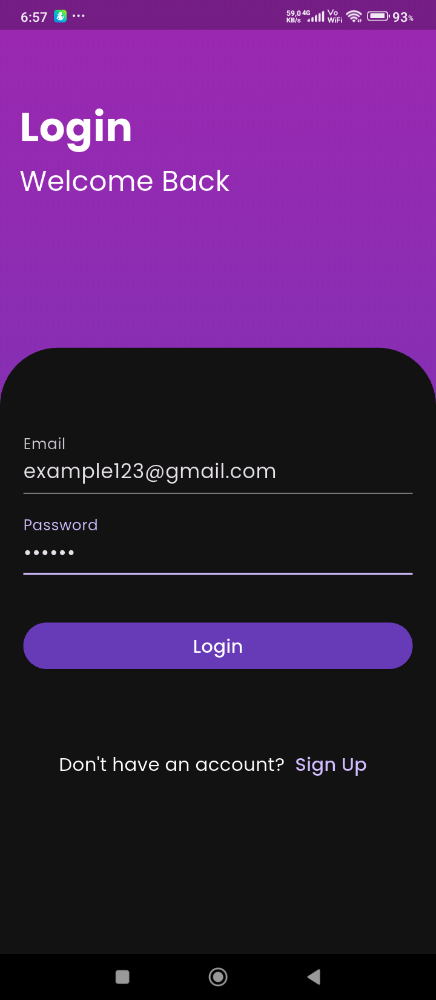
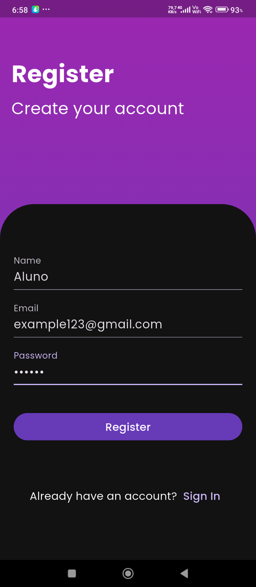
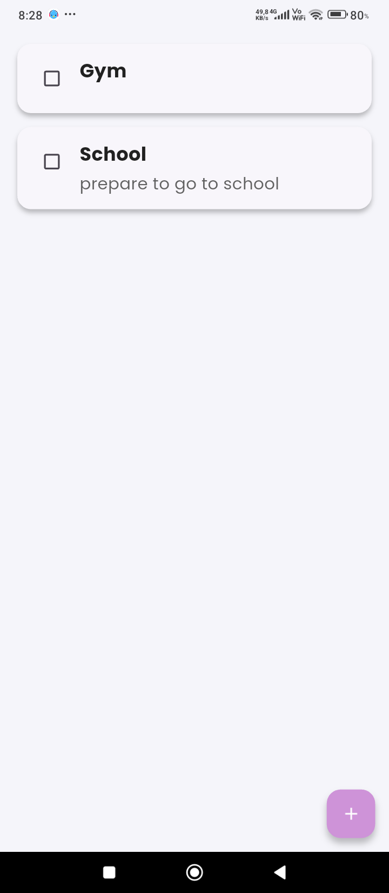
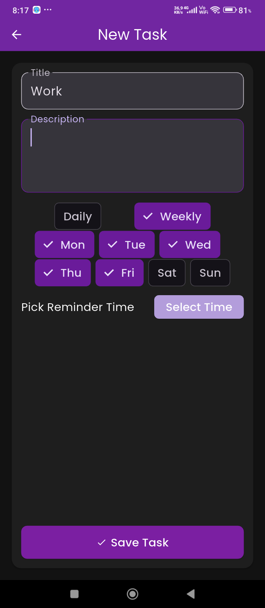

# 📋 Gerenciador de Atividades Diárias
**App Flutter de produtividade com autenticação, sincronização e notificações locais**

---

## 🚀 Visão Geral — Qual problema eu resolvo?
Este aplicativo ajuda pessoas **a gerenciar tarefas diárias com lembretes e sincronização de dados em tempo real**.  
Muitos apps de tarefas são **isolados ou visuais apenas** — este app foi pensado para:

- ✅ Usuários que precisam de **cadastro seguro**
- ✅ Lembretes que realmente disparam no horário definido
- ✅ Dados sincronizados entre dispositivos via Firebase
- ✅ Interface fluida e responsiva
- ✅ Testes automatizados que garantem confiabilidade

> Este não é “mais um To‑Do genérico” — é um **sistema completo de produtividade com backend real**, testes e deploy automatizado.

---

## 📲 Screenshots com contexto de uso

<p align="center">
  
  
  
  
</p>

> As telas acima mostram o app funcionando com dados reais de usuário — autenticação, visualização de tarefas e edição.

---

## 🧠 Decisões Técnicas e Justificativas

| Escolha Técnica | Justificativa |
|-----------------|---------------|
| **Flutter + GetX** | Permite UI reativa e gerenciamento de estado sem boilerplate excessivo; melhora produtividade sem sacrificar escalabilidade. |
| **Firebase Authentication** | Solução segura e amplamente usada para autenticação de usuários sem servidor backend próprio. |
| **Cloud Firestore** | Banco de dados em tempo real que sincroniza entre dispositivos e garante persistência confiável. |
| **Notificações Locais** | Permite lembretes efetivos, mesmo quando o app está em segundo plano. |
| **Clean Architecture** | Separa UI, domínio e integração com serviços externos — facilitando testes e manutenção. |
| **CI/CD com GitHub Actions** | Automatiza testes e builds em cada commit, garantindo qualidade contínua. |
| **Testes Automatizados** | Testes de unidade e integração que capturam comportamento crítico. |

---

## 🛠 Tecnologias Utilizadas

- **Flutter 3.9.0 + Dart**  
- **GetX** – Estado e rotas reativos  
- **Firebase Auth & Firestore** – Backend sem servidor  
- **Notificações Locais** – Flutter Local Notifications  
- **Mocktail / fake_firestore** – Testes unitários com simulações  
- **GitHub Actions** – CI/CD  
- **Codecov** – Indicador de cobertura (controle de qualidade)

---

## 🧪 Testes Automatizados (com exemplos)

Escrever testes não é “marcar caixinha”. Aqui está **o que os testes garantem**:

- Fluxo de autenticação funciona com dados válidos  
- Erros de login geram mensagens apropriadas  
- CRUD de tarefas funciona corretamente  
- Lembretes são agendados conforme esperado  
- Camada de domínio isolada da camada de Firebase

### Exemplos
```bash
flutter test --coverage

## 🚀 Estrutura do Projeto

lib/
├── data/         # Repositórios, mapeadores e integração Firebase
├── domain/       # Entidades e regras de negócio puras
├── presentation/ # UI, Controllers e Bindings (GetX)
├── service/      # Serviços como notificações e helpers 

---

## 🎯 Diferenciais do Projeto

- Arquitetura modular, limpa e escalável (**Clean Architecture**).  
- Código totalmente testável, com alta cobertura de testes unitários.  
- Integração real com Firebase e notificações locais.  
- Facilita futuras implementações e manutenção do código.  

---

## 🔄 Roadmap

- [ ] Login com Google
- [ ] Sincronização offline
- [ ] Integração com calendário

[📲 Baixar Lista de Tarefas v1.0](https://github.com/emanoelsg/list_firebase/releases/latest/download/app-release.apk)

